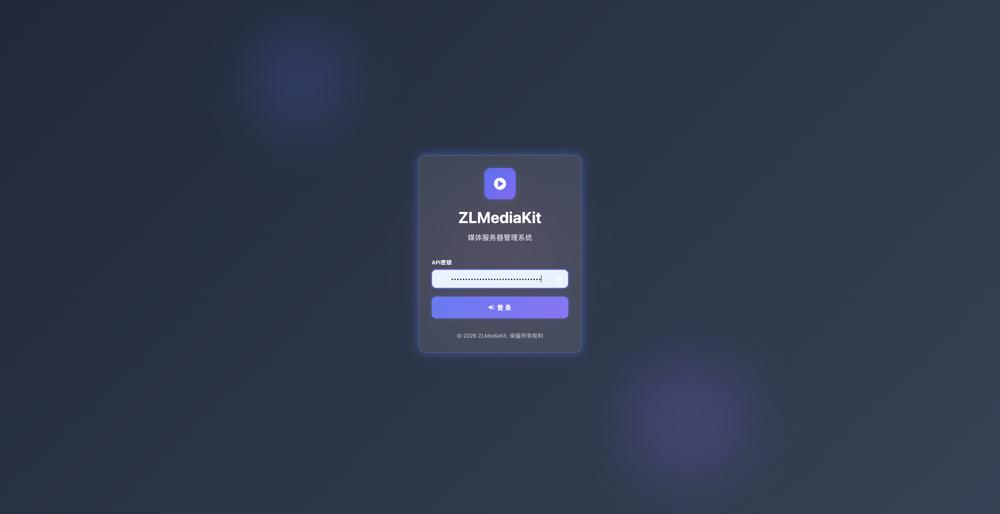
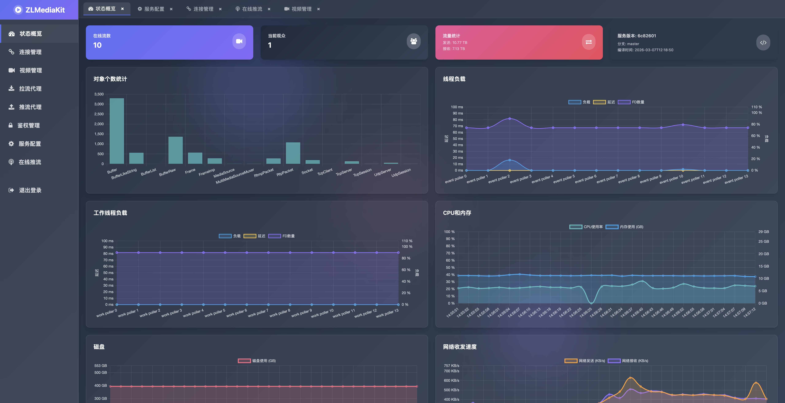
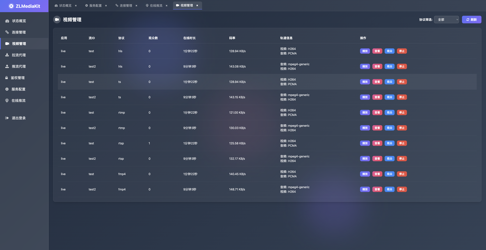
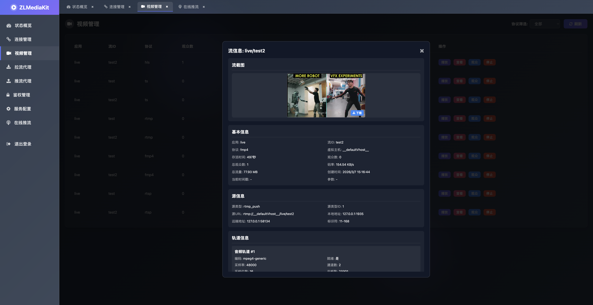
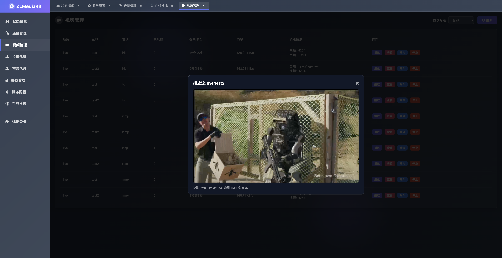
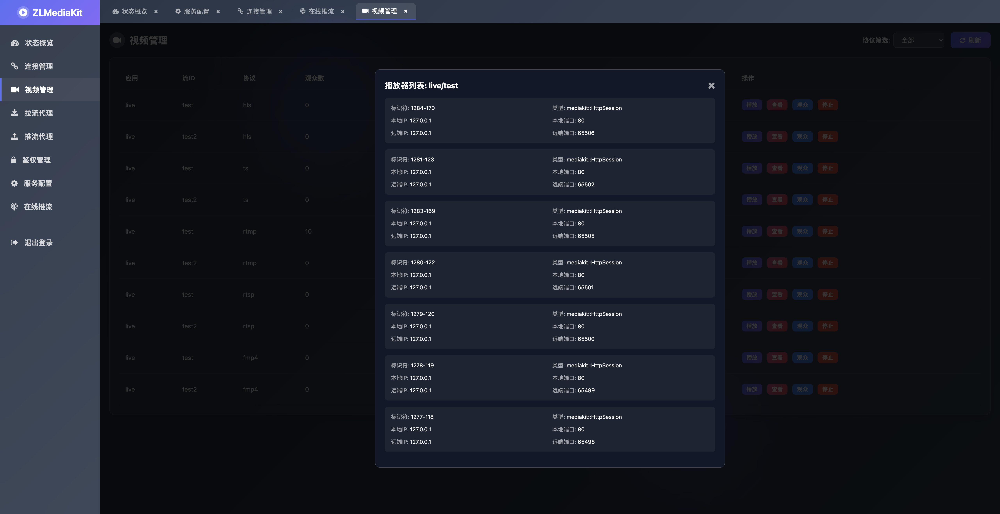
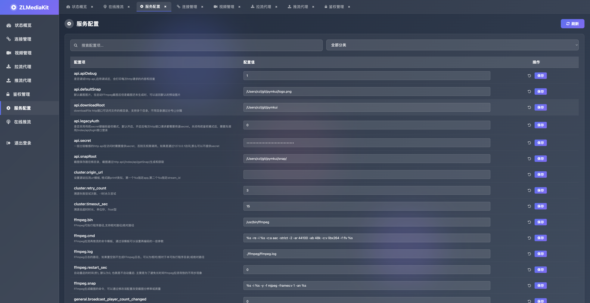
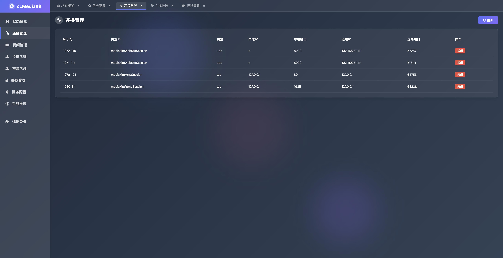
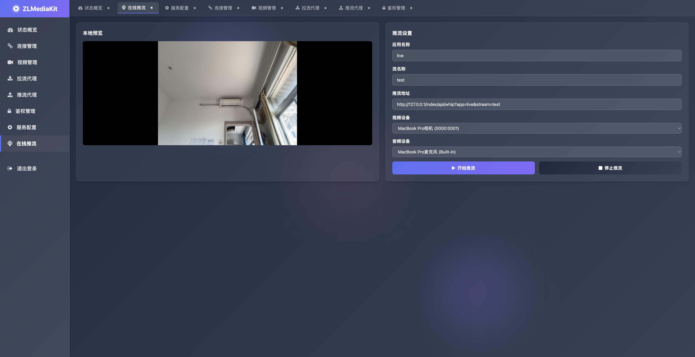

# PyMKUI

PyMKUI是一个为ZLMediakit设计的现代化前端管理界面，提供了直观、美观的视频流管理功能。

## 项目介绍

PyMKUI是基于Web技术开发的前端界面，专为ZLMediakit流媒体服务器打造，提供了以下功能：

- 视频流管理（查看、播放、停止）
- 流信息查看
- 观众列表管理
- 流截图功能
- 服务器状态监控

## 与ZLMediakit的关系

ZLMediakit是一个高性能的流媒体服务器，支持RTSP、RTMP、HLS、HTTP-FLV、WebSocket-FLV等多种流媒体协议。PyMKUI作为ZLMediakit的前端管理界面，提供了以下优势：

1. **简化管理**：通过直观的Web界面管理ZLMediakit服务器，无需命令行操作
2. **实时监控**：实时查看流状态、观众数量、码率等信息
3. **便捷操作**：一键播放、停止流，查看详细信息
4. **流截图**：支持获取流截图，便于预览流内容

## 技术栈

- **前端**：HTML5、CSS3、JavaScript
- **样式**：Tailwind CSS
- **图标**：Font Awesome
- **播放器**：原生HTML5视频播放器、Jessibuca（FLV播放）、WHEP（WebRTC播放）

## 界面展示

### 登录页面



### 服务器状态



### 视频管理页面



### 流信息查看



### 流播放



### 观众列表



### 系统设置



### 连接管理



### 在线推流



## 安装使用

### 1. 准备工作

1. 克隆本项目到本地
2. 确保ZLMediakit服务器已经编译安装

### 2. 安装Python依赖

```bash
# 进入backend目录
cd pymkui/backend

# 安装依赖
pip install -r requirements.txt
```

### 3. 配置ZLMediakit

1. **开启Python编译**：确保ZLMediakit编译时开启了Python支持
2. **修改ZLMediakit配置文件**：在配置文件中添加以下配置

```ini
[python]
plugin=mk_plugin
```

3. **指定PYTHONPATH环境变量**：设置PYTHONPATH环境变量包含pymkui/backend目录
4. **设置HTTP根目录**：在ZLMediakit配置文件的[http]部分添加以下配置

```ini
[http]
rootPath=pymkui/frontend
```

### 4. 启动服务

1. 启动ZLMediakit服务器
2. 打开浏览器访问 `http://your-server-ip:80/`
3. 输入ZLMediakit服务器地址和secret密钥登录

## 功能特点

- **响应式设计**：适配不同屏幕尺寸
- **实时数据**：实时更新流状态和服务器信息
- **直观操作**：简单易用的界面设计
- **多协议支持**：支持多种流媒体协议的管理
- **流截图**：支持获取和下载流截图

## 注意事项

- 本项目需要与ZLMediakit服务器配合使用
- 确保服务器地址和secret密钥正确
- 部分功能可能需要ZLMediakit特定版本支持

## 贡献

欢迎提交Issue和Pull Request，帮助改进本项目。

## 未来规划

我们计划在未来的版本中实现以下功能：

1. **完善播放、推流鉴权**：加强安全性，实现更灵活的鉴权机制
2. **添加SQLite持久化**：主要用于推拉流任务的持久化，存储配置和历史数据，提高系统可靠性
3. **添加录像文件管理**：实现录像文件的管理、查询和下载功能
4. **添加推拉流代理**：支持更灵活的流分发和转发
5. **Python转码、推理功能**：利用Python的强大生态，实现视频转码和AI推理功能

## 许可证

本项目采用MIT许可证。
